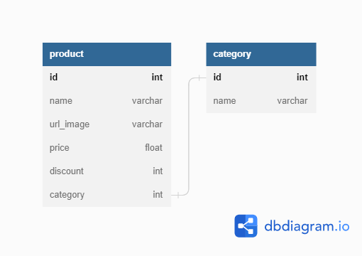

## Nodejs Sequelize RESTAPI MySQL

Esta es una simple REST API utilizando Javascript y MySQL

- nodejs
- express
- mysql
- sequelize

## Modelado

Esta es la relacion que utilizamos para este ejercicio


## Estructura del proyecto

```bash
.
├── package.json
├── express_config.js
├── index.js
└── database
    ├── controllers
    │   ├── categoryController.js
    │   └── productController.js
    ├── database
    │   └── database.js
    ├── models
    │   ├── categtoriesModel.js
    │   └── productsModel.js
    └── routes
        ├── categoryRoutes.js
        └── productRoutes.js

5 directories, 10 files
```
